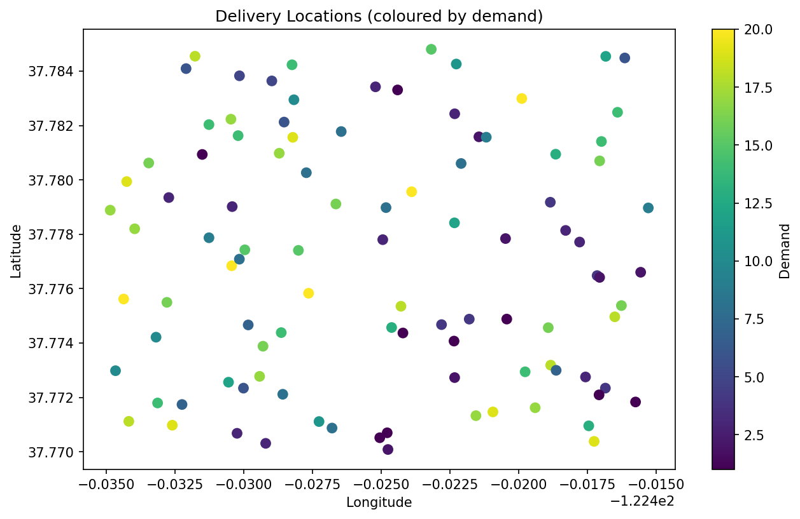
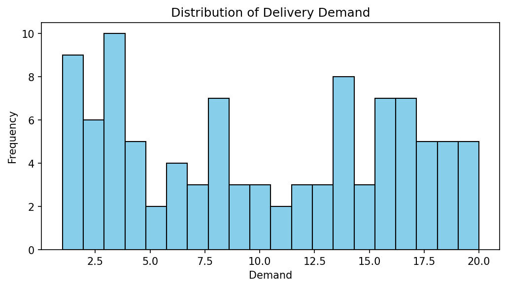
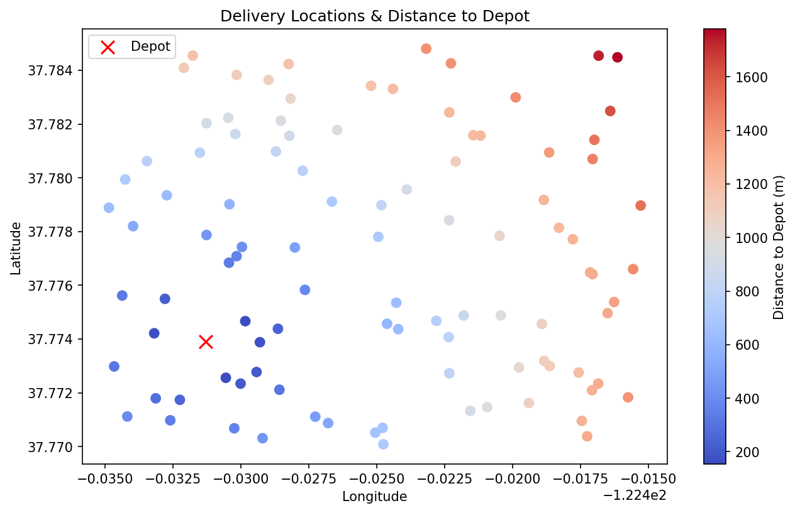
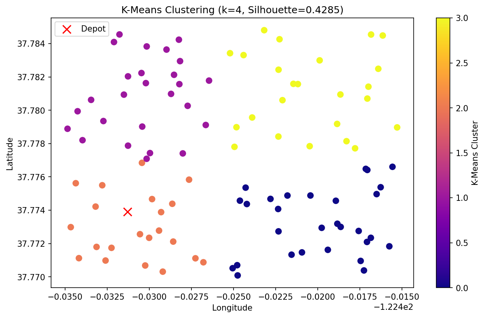
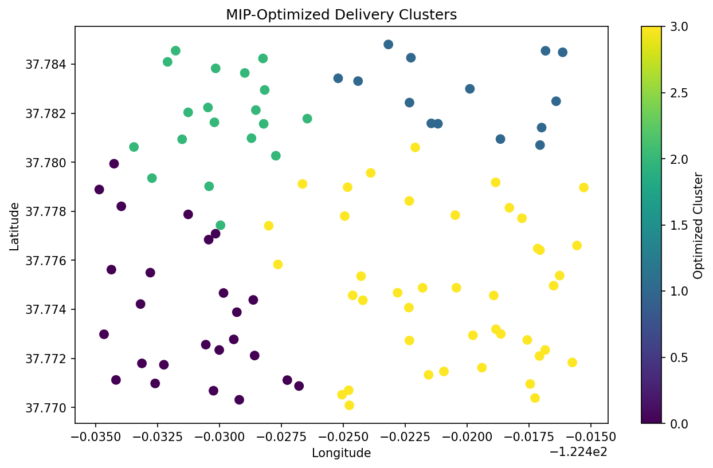

# Neighbourhood Clustering Optimization

An end-to-end machine learning and operations research pipeline for optimizing delivery zone clustering in last-mile logistics.
This project combines **unsupervised learning (DBSCAN, K-Means)** with **Mixed Integer Programming (MIP)** to minimize total travel distance while respecting operational constraints.

---

## 🚀 Overview

Last-mile delivery is one of the most expensive components of logistics operations. Efficiently grouping delivery locations into optimized neighbourhoods can significantly reduce travel time, fuel costs, and operational inefficiencies.

This project builds a **production-ready pipeline** that:

* Clusters delivery points based on spatial patterns
* Evaluates clustering quality using silhouette scores
* Applies mathematical optimization to refine cluster assignments
* Generates visual and interactive outputs for decision-making

---

## 🧠 Problem Statement

Given a set of delivery locations with demand values:

* How can we group them into optimal clusters (delivery zones)?
* How do we minimize total travel distance?
* How do we enforce real-world constraints like vehicle capacity?

---

## ⚙️ Approach

The solution combines **machine learning + optimization**:

### 1. Feature Engineering

* Compute geodesic distance from a central depot using `geopy`
* Normalize spatial features for clustering algorithms

### 2. Clustering Models

* **DBSCAN** (density-based clustering)

  * Detects natural clusters and noise points
* **K-Means**

  * Evaluated over multiple cluster sizes
  * Optimal `k` selected using silhouette score

### 3. Optimization (MIP)

* Formulated as a **Mixed Integer Programming problem**
* Objective:

  * Minimize total travel distance
* Constraints:

  * Each delivery assigned to exactly one cluster
  * Cluster capacity limits (demand constraints)
  * Balanced distribution of deliveries

Solved using **PuLP (Linear Programming)**

---

## 📊 Visual Insights

### 1. Delivery & Demand Overview
Before optimization, we analyze the spatial distribution and the "weight" (demand) of each delivery point.
| Delivery Locations | Demand Distribution |
|---|---|
|  |  |

### 2. Distance to Depot
We engineer features to understand the proximity of each delivery point to the central warehouse.


### 3. Clustering Results (ML vs. Optimization)
We first use **K-Means** to find natural clusters based on geography, then apply **MIP** to "fix" clusters so they never exceed vehicle capacity.

**Initial K-Means Clusters:**


**Final Optimized & Balanced Clusters:**


---

## 🧠 How it Works

1.  **Feature Engineering**: Uses the Haversine formula to calculate real-world distances on the Earth's surface.
2.  **Machine Learning**: Runs a search for the optimal number of clusters ($k$) using **Silhouette Scores**.
3.  **Constraint Optimization**: Uses **PuLP** to solve a Mixed-Integer Program where:
    * **Objective**: Minimize total distance.
    * **Constraint**: Total `Demand` in a cluster $\leq$ `Vehicle Capacity`.
    * **Constraint**: Every point must be assigned to exactly one cluster.


---

## 📁 Project Structure

```
neighbourhood-clustering-optimization/
├── config/
│   └── settings.py          # Centralized config (hyperparams, paths, constants)
├── data/
│   └── OR_sample_data.csv   # Raw input data
├── outputs/
│   ├── figures/             # Saved plots
│   └── maps/                # Interactive Folium maps
├── src/
│   ├── data/
│   │   └── loader.py        # Data loading & validation
│   ├── features/
│   │   └── engineering.py   # Feature engineering
│   ├── models/
│   │   └── clustering.py    # DBSCAN & K-Means
│   ├── optimization/
│   │   └── optimization.py  # MIP optimization (PuLP)
│   ├── visualization/
│   │   └── plots.py         # Visualizations
│   └── main.py              # Pipeline entry point
├── notebooks/
│   └── exploration.ipynb    # Original notebook
├── tests/
│   └── test_clustering.py
├── requirements.txt
└── README.md
```

---

## 🛠️ Setup & Installation

```bash
# 1. Create virtual environment
python -m venv venv

# Activate environment
# Windows:
venv\Scripts\activate
# Mac/Linux:
source venv/bin/activate

# 2. Install dependencies
pip install -r requirements.txt

# 3. Add dataset
Place your dataset inside:
data/OR_sample_data.csv

# 4. Run pipeline
python -m src.main
```

---

## 🔄 Pipeline Workflow

1. **Data Loading**

   * Validates dataset schema
   * Checks missing values and structure

2. **Feature Engineering**

   * Computes distance-to-depot
   * Prepares features for clustering

3. **DBSCAN Clustering**

   * Identifies density-based clusters
   * Flags noise points

4. **K-Means Optimization**

   * Searches optimal cluster count (k = 3–6)
   * Selects best model via silhouette score

5. **MIP Optimization**

   * Refines cluster assignments
   * Minimizes global travel distance
   * Enforces operational constraints

6. **Evaluation**

   * Cluster summaries
   * Distance statistics
   * Silhouette scores

7. **Visualization**

   * Static plots (Matplotlib)
   * Interactive map (Folium)

---

## 📊 Key Results

* **Best clustering model:** K-Means (k = 4)
* **Silhouette Score:** 0.4285
* **Total optimized travel distance:** ~49,716 meters
* **All deliveries successfully assigned (0 unassigned)**

---

## 📈 Outputs

### Saved Figures

Located in:

```
outputs/figures/
```

Includes:

* Delivery location scatter plot
* Demand distribution (histogram & boxplot)
* Distance-to-depot analysis
* DBSCAN clusters
* K-Means clusters
* Optimized cluster visualization

### Interactive Map

```
outputs/maps/cluster_map.html
```

* Fully interactive
* Color-coded clusters
* Zoomable geographic view

### Final Dataset

```
outputs/delivery_clusters.csv
```

Contains:

* Cluster assignments
* Demand per location
* Distance metrics

---

## 🧪 Testing

Run unit tests:

```bash
pytest tests/
```

---

## 🔮 Future Improvements

* Add real-world datasets (Uber, logistics APIs)
* Convert pipeline into a REST API (FastAPI)
* Build interactive dashboard (Streamlit)
* Incorporate route optimization (VRP)
* Add automated hyperparameter tuning

---

## 💡 Key Takeaways

* Combining **ML + optimization** leads to significantly better results than clustering alone
* MIP enables enforcement of real-world constraints often ignored in ML models
* Modular architecture allows easy extension and production deployment

---

## 👤 Author

**Henry C. Dibie**
Data Analyst | Machine Learning | Optimization Systems